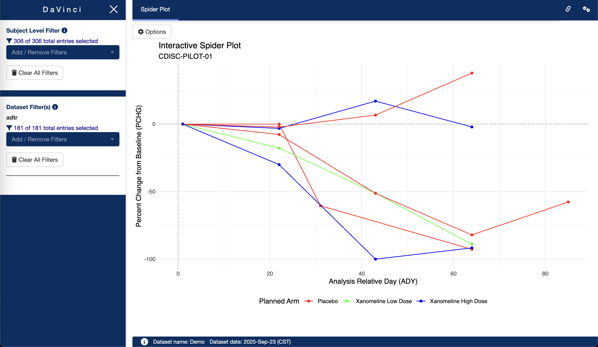

# dv.spiderplot

## Overview

The {dv.spiderplot} package provides a Shiny module for creating interactive spider plots that visualize patient-level response data over time. Spider plots are particularly valuable in oncology efficacy analysis, where they display individual patient trajectories showing changes in tumor size or other clinical measurements across multiple visits.



## Installation

You can install the development version of {dv.spiderplot} from:

```r
if (!require("remotes")) install.packages("remotes")
remotes::install_github("Boehringer-Ingelheim/dv.spiderplot")
```
